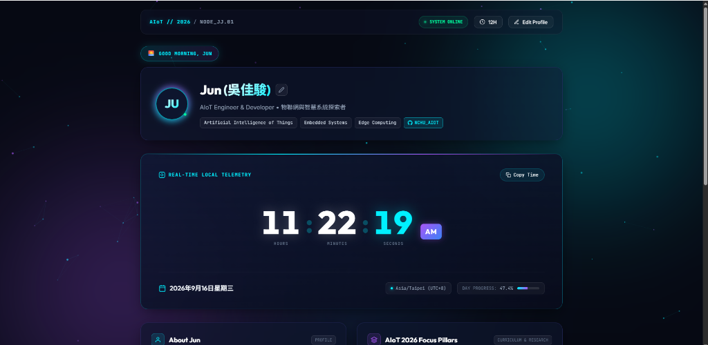

# NCHU_AIOT • Personal Space & Live Clock Dashboard

A sleek, responsive personal dashboard and high-precision live clock built with modern web standards, glassmorphism aesthetics, and real-time state persistence.

## 🔗 Live Demonstration

👉 Live Demo: https://jiajun1014.github.io/NCHU_AIOT/



---

## ✨ Features

- **Live Real-Time Precision Clock**: Frame-accurate digital clock updating hours, minutes, seconds, and millisecond fractions with a smooth continuous progress bar.
- **Dynamic Greeting & Timezone Detection**: Automatically greets according to local time (*Good morning*, *Good afternoon*, *Good evening*, *Working late*) and detects user timezone and city.
- **12H / 24H Toggle**: Instant switching between standard 12-hour (with AM/PM badge) and military 24-hour time.
- **Day Cycle Tracker**: Computes and displays the percentage of the 24-hour day elapsed and current workflow phase.
- **Interactive Focus Widgets**:
  - **Deep Work Stopwatch**: Stopwatch with start, pause, resume, and reset.
  - **Daily Focus & Intentions**: Memo notepad with auto-save to `localStorage`.
- **Dynamic Themes**: Color accents with vibrant glassmorphic gradients: Cyan, Violet, Emerald, and Amber.
- **Personalized Profile**: In-place editable name, bio, and status tag that automatically sync with `localStorage`.

---

## 🚀 Quick Start

### Run locally

No build tools required! You can open `index.html` directly in any modern browser, or serve it using Python or Node:

```bash
# Using Python
python -m http.server 3456

# Or using Node.js (npx)
npx serve .
```

Then visit [http://localhost:3456](http://localhost:3456) in your browser.

---

## 🛠 Tech Stack

- **HTML5**: Semantic layout and accessibility
- **Vanilla CSS3**: Modern glassmorphism, CSS variables, fluid typography, responsive grid
- **Vanilla JavaScript (ES6+)**: `requestAnimationFrame` clock loop, `Intl.DateTimeFormat`, `localStorage` persistence

---

## 👤 Author

- **JUN** ([@jiajun1014](https://github.com/jiajun1014))
- Repository: [NCHU_AIOT](https://github.com/jiajun1014/NCHU_AIOT)
